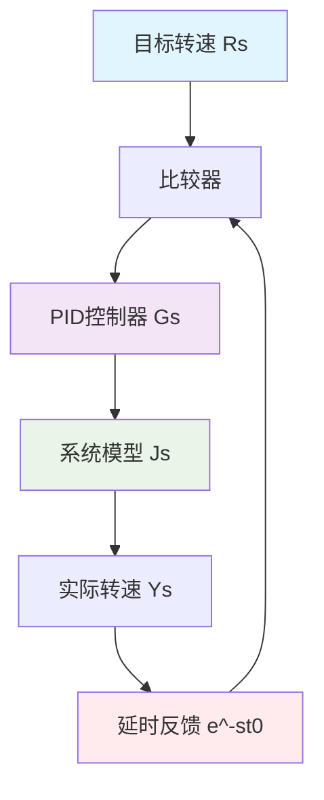
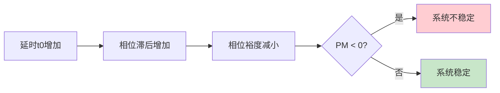
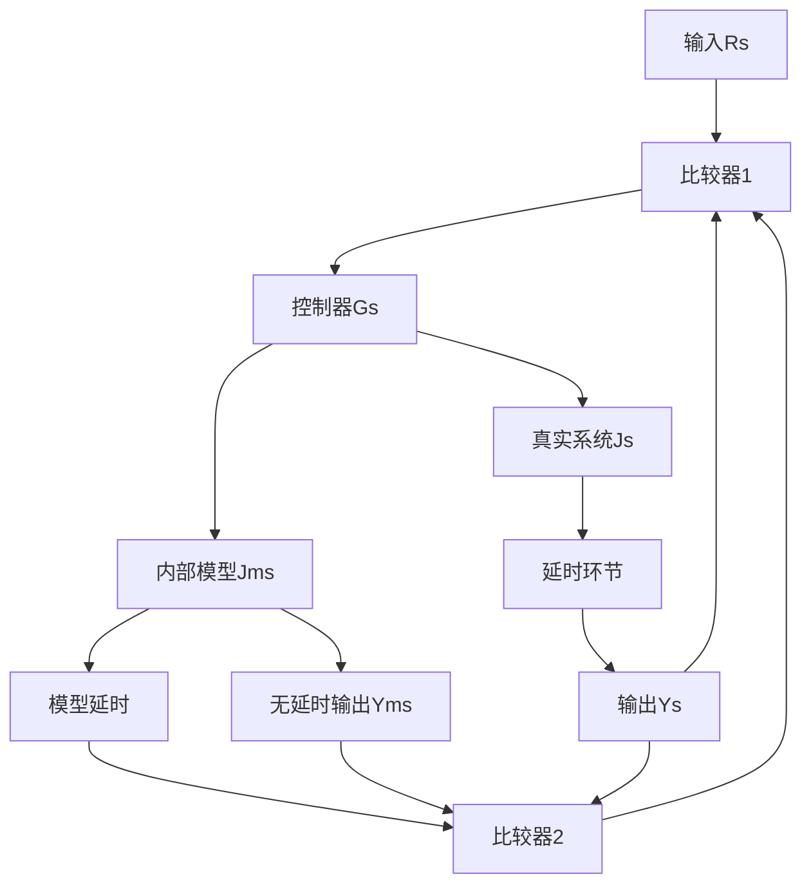
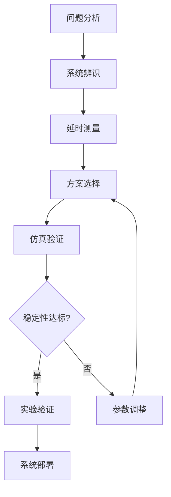

# 电机PID控制系统中延时反馈的稳定性分析与解决方案

## 1. 系统概述

### 1.1 控制系统组成

**系统框图：**

**系统说明：**

- **PID控制器$G(s)$**：比例-积分-微分控制器，产生控制信号
- **系统辨识$J(s)$**：电机系统的传递函数模型  
- **延时反馈$e^{-st_0}$**：反馈回路中的时间延迟环节

### 1.2 核心问题：延时反馈对系统稳定性的影响

**关键概念：**
> **相位滞后(Phase Lag)**：延时环节在频域中表现为相位随频率线性下降，这是导致系统不稳定的主要原因。
>
> **相位裕度(Phase Margin)**：衡量系统相对稳定性的重要指标，表示系统在增益交越频率处距离-180°相位的"安全距离"。

## 2. 系统建模与稳定性理论分析

### 2.1 闭环系统数学模型

**开环传递函数：**
$$
L(s) = G(s)J(s)e^{-st_0}
$$

**闭环传递函数：**
$$
T(s) = \frac{G(s)J(s)}{1 + G(s)J(s)e^{-st_0}}
$$

**特征方程（稳定性判据）：**
$$
1 + G(s)J(s)e^{-st_0} = 0
$$

### 2.2 频域稳定性分析

**频率响应特性：**

- **幅度响应**：$|L(j\omega)| = |G(j\omega)J(j\omega)|$
- **相位响应**：$\angle L(j\omega) = \angle G(j\omega)J(j\omega) - \omega t_0$

**相位裕度计算：**
$$
PM_{\text{delay}} = 180^\circ + \angle G(j\omega_c)J(j\omega_c) - \omega_c \cdot t_0
$$

**理论要点注释：**
> **增益交越频率$\omega_c$**：系统开环增益为1 ($|L(j\omega_c)| = 1$) 时的频率，反映系统带宽。延时的影响在此频率处最为显著。

### 2.3 延时对稳定性的影响机制

**稳定性分析框图：**

**主要影响：**

1. **相位滞后累积**：延时项$e^{-j\omega t_0}$产生$-\omega t_0$的相位滞后
2. **相位裕度降低**：直接减少系统的稳定边界
3. **特征方程复杂化**：超越方程可能产生无限多个根

**数学本质注释：**
> 延时环节使特征方程变为**超越方程(Transcendental Equation)**，这在数学上比普通代数方程复杂得多，可能产生无穷多个特征根，增加了稳定性分析的难度。

## 3. 解决方案与补偿策略

### 3.1 参数调整方法

#### 3.1.1 比例增益调整

- **策略**：降低$K_p$值
- **效果**：减小$\omega_c$，降低$\omega_c \cdot t_0$乘积
- **代价**：系统响应速度变慢

**工程实践注释：**
> 参数调整是**最直接**的解决方案，但需要在响应速度与稳定性之间进行**权衡取舍**。建议使用齐格勒-尼科尔斯方法 https://www.kepuchina.cn/article/articleinfo?business_type=100&ar_id=218563 进行系统化整定。

### 3.2 史密斯预估器(Smith Predictor)

#### 3.2.1 系统结构

#### 3.2.2 数学原理

**修正误差信号：**
$$
E(s) = R(s) - \left[Y(s)e^{-st_0} - Y_m(s)e^{-st_{0_m}} + Y_m(s)\right]
$$

**理想补偿条件：**

- 当$J_m(s) = J(s)$且$t_{0_m} = t_0$时
- 特征方程中消除延时项
- 系统稳定性显著改善

**注：**
> 史密斯预估器是**模型预测控制**的早期形式，通过内部模型预测系统行为来补偿外部延时。对模型精度要求较高。

### 3.3 预测观测器设计

#### 3.3.1 状态空间方法

**系统状态方程：**
$$
\begin{aligned}
\dot{x}(t) &= Ax(t) + Bu(t) \\
y(t) &= Cx(t)
\end{aligned}
$$

**预测观测器：**
$$
\hat{x}(t + t_0) = e^{At_0}\hat{x}(t) + \int_{0}^{t_0} e^{A\tau}Bu(t-\tau)d\tau
$$

#### 3.3.2 卡尔曼滤波器

- **状态预测**：基于系统模型
- **测量更新**：融合延时测量值
- **最优估计**：估计无延时状态

### 3.4 方案比较与选择

| 方案类型 | 适用场景 | 实施难度 | 效果预期 |
|---------|----------|----------|----------|
| 参数调整 | 小延时(t0 < 0.1T)* | 低 | 中等 |
| 史密斯预估器 | 模型准确、中大延时 | 中高 | 优良 |
| 状态观测器 | 系统可观测、噪声较大 | 中 | 良好 |
| 硬件优化 | 延时主要来自硬件 | 中 | 根本解决 |

*$T$为系统主要时间常数

## 4. 设计流程与验证方法

### 4.1 系统化设计流程

### 4.2 稳定性验证方法

#### 4.2.1 频域分析

- **伯德图**：检查相位裕度和增益裕度
- **奈奎斯特图**：观察包围(-1,0)点的情况

#### 4.2.2 时域仿真

**性能指标：**

- 超调量：$\sigma \% = \frac{y_{\max} - y_{\infty}}{y_{\infty}} \times 100\%$
- 调节时间：$t_s$（达到±2%稳态值）
- 稳态误差：$e_{ss}$

### 4.3 鲁棒性

**模型不确定性影响：**
$$
\Delta PM = -\omega_c \cdot \Delta t_0 - \text{相位模型误差}
$$

**设计建议：**

- 保留额外的相位裕度(通常$PM > 45^\circ$)
- 考虑最坏情况下的延时变化
- 设计自适应机制

## 5. 实例分析

### 5.1 电机速度控制

**系统参数：**

- 电机传递函数：$J(s) = \frac{K_m}{s(\tau s + 1)}$
- PID控制器：$G(s) = K_p + \frac{K_i}{s} + K_d s$
- 反馈延时：$t_0 = 50\text{ms}$

**稳定性边界计算：**
$$
\omega_c \cdot t_0 < PM_{\text{required}} - (180^\circ + \angle G(j\omega_c)J(j\omega_c))
$$

## 6. 调参效果目标

### 6.1 关键点

1. **延时本质**：延时通过相位滞后机制破坏稳定性
2. **补偿原理**：基于模型预测和相位补偿
3. **设计权衡**：性能vs稳定性vs鲁棒性

---
**文档说明**：本文档提供了电机PID控制系统中延时反馈稳定性问题的完整分析框架和解决方案，包含理论基础、工程方法和实施指南，适用于控制系统工程师和研究人员参考使用。
